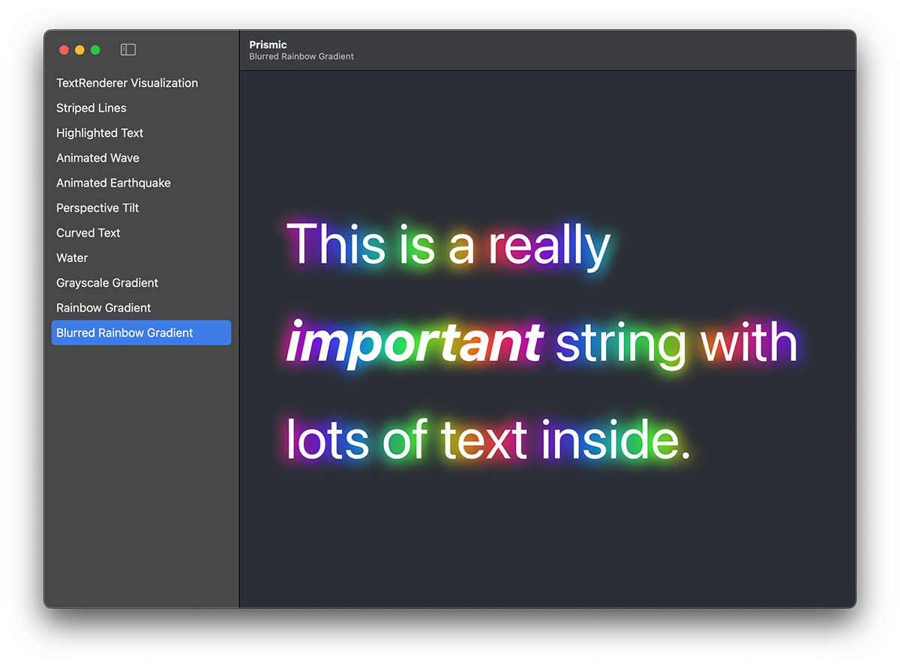

    

    
    
    
    

Prismic is a collection of `TextRenderer` examples for SwiftUI apps, showing how you can render text in different ways with special effects. 

Some effects use pure Swift code, and others bring in Metal distortion and color shaders to produce more advanced effects.

## See it in action

This repository contains a macOS sample project demonstrating all the example renderers in action. The sample project is built using SwiftUI and macOS 15 or later. The text renderers can be used on other platforms – iOS 18 or later, visionOS 2 or later, and so on.

## Contributing

I made Prismic to provide sample code for folks who want to create interesting text effects wit SwiftUI. If you’d like to contribute your own text renderers or improve existing ones, that’s great! But first please read the following:

- All code must be licensed under the MIT license so it can benefit the most people.
- We use the [Contributor Covenant Code of Conduct](CODE_OF_CONDUCT.md) to ensure everyone feels welcome in the project.

## License

MIT License.

Copyright (c) 2025 Paul Hudson.

Permission is hereby granted, free of charge, to any person obtaining a copy of this software and associated documentation files (the "Software"), to deal in the Software without restriction, including without limitation the rights to use, copy, modify, merge, publish, distribute, sublicense, and/or sell copies of the Software, and to permit persons to whom the Software is furnished to do so, subject to the following conditions:

The above copyright notice and this permission notice shall be included in all copies or substantial portions of the Software.

THE SOFTWARE IS PROVIDED "AS IS", WITHOUT WARRANTY OF ANY KIND, EXPRESS OR IMPLIED, INCLUDING BUT NOT LIMITED TO THE WARRANTIES OF MERCHANTABILITY, FITNESS FOR A PARTICULAR PURPOSE AND NONINFRINGEMENT. IN NO EVENT SHALL THE AUTHORS OR COPYRIGHT HOLDERS BE LIABLE FOR ANY CLAIM, DAMAGES OR OTHER LIABILITY, WHETHER IN AN ACTION OF CONTRACT, TORT OR OTHERWISE, ARISING FROM, OUT OF OR IN CONNECTION WITH THE SOFTWARE OR THE USE OR OTHER DEALINGS IN THE SOFTWARE.

Prismic was made by [Paul Hudson](https://twitter.com/twostraws), who writes [free Swift tutorials over at Hacking with Swift](https://www.hackingwithswift.com). It’s available under the MIT license, which permits commercial use, modification, distribution, and private use.

    

&nbsp;

     
    A Hacking with Swift Project

